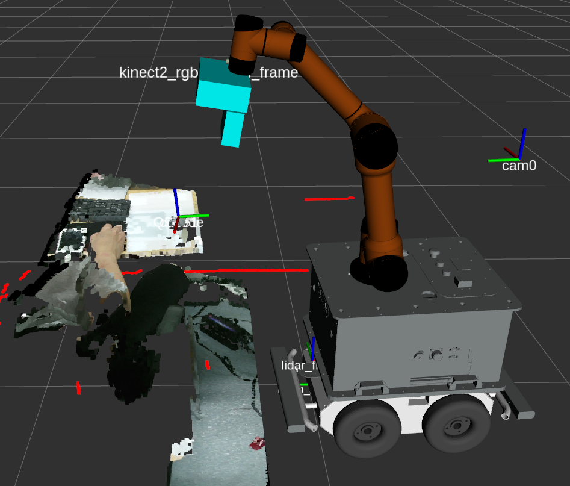
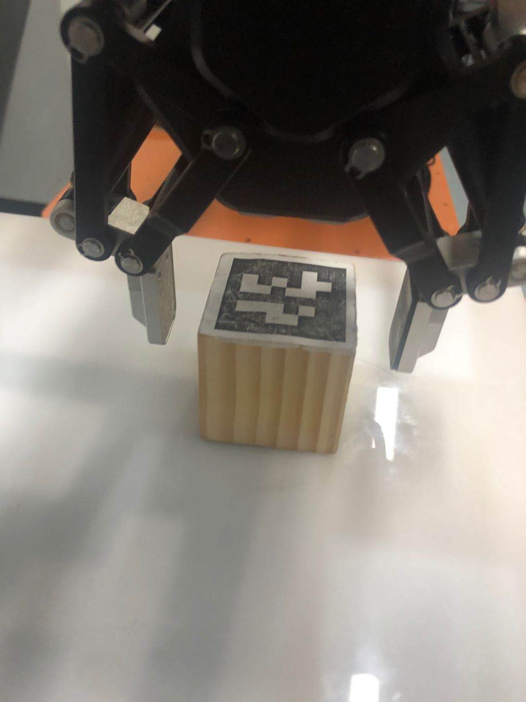
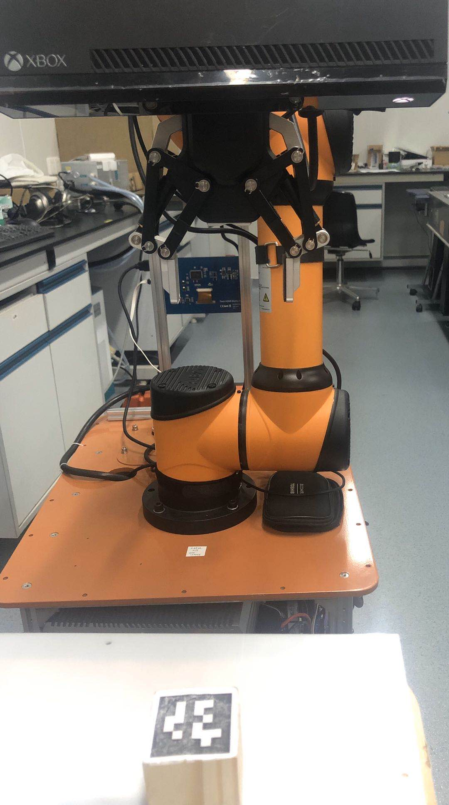
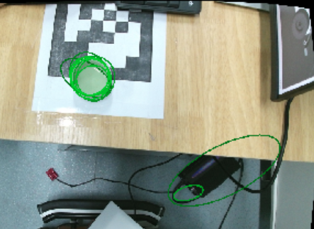
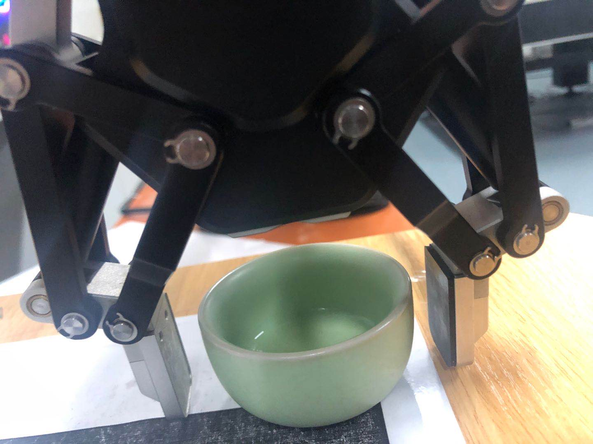
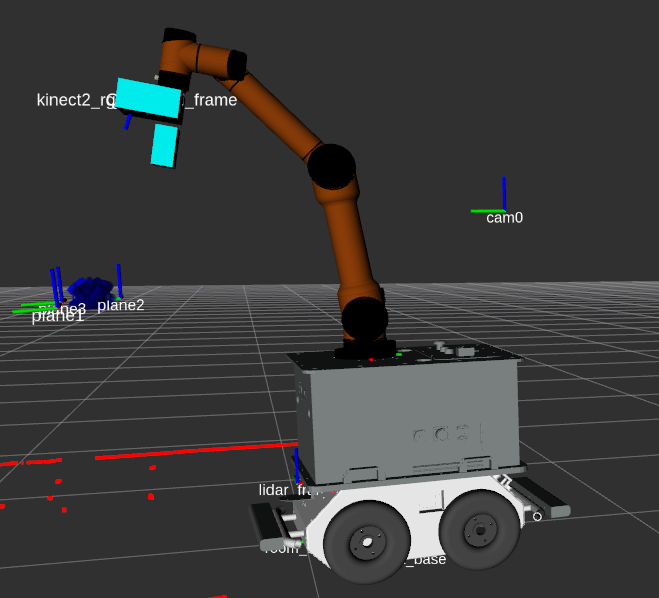
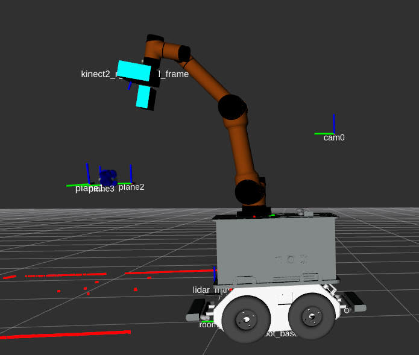
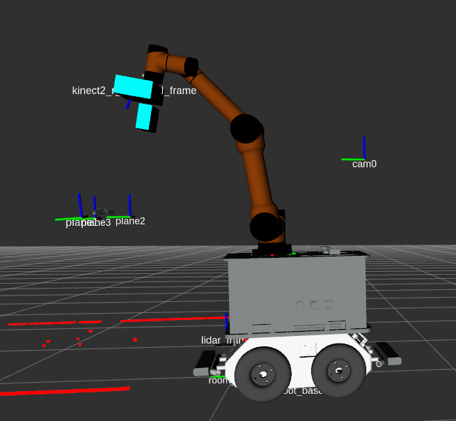
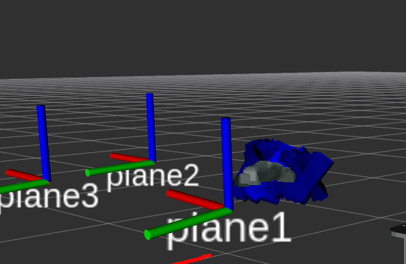

# aubo_arm_usr

-----------------------------------
    作 者 : 南 山 二 毛
    版 本 : Ver1.2
    时 间 : 2020.06.04
-----------------------------------
版本更改信息:增加杂乱物体的抓取


-----------------------------------
    概     述
-----------------------------------
这是关于aubo-i5机械臂+视觉导引的用户开发程序

主要实现功能:

1, TF坐标系建立和机器人模型的可视化界面;

2, 视觉定位信息订阅;

3, 机械臂运动应用层面的开发:

   识别二维码立方体,并抓取,摆放;(已经完成)

   识别多个不同形状的杯子并抓取放置;(已完成)

   基于gpd的深度学习机械臂末端位姿生成和抓取(已完成)


------------------------------------
    包 含 模 块
------------------------------------
1, ros功能包: apriltag_ros;

2, ros功能包: aubo_robot;

3, ros功能包: dh_hand_driver;

4, ros功能包: aubo_arm_usr;

5, ros功能包: gpd_ros;

6, ros功能包: iai_kinect;

7, 实物: 相机, 推荐kenectV2相机 或者realsense f200, 其它相机也可以;

8, 实物: aubo_i5机械臂机器控制器一套;

9, 实物: 大寰手抓一套;

10, 实物: 贴有apriltag标签的立方体若干个;

11, 圆形口杯子若干;

12, 下载其他包：ros-kinetic-ompl  libompl  ros-kinetic-ompl   ros-kinetic-ompl  ros-kinetic-moveit

- 各个模块简单使用： 

##### setup aubo-i5 arm

```
roslaunch aubo_i5_moveit_config moveit_planning_execution.launch sim:=false robot_ip:=192.168.13.5
``` 
##### control DH AG-95 grasper

控制器无法正常连接电脑的问题：

拔掉所有usb口的线，然后断电重新启动。

```
roslaunch dh_hand_driver dh_hand_controller.launch
rosrun aubo_arm_usr hand_client 1 10 10
```

------------------------------------
    结 果 展 示
------------------------------------

##### 基于二维码的抓取






##### 杯子的抓取




##### 基于点云的神经网络生成夹爪,并进行物体的抓取

 
 
 
------------------------------------
    运 行 顺 序
------------------------------------
1, 确保与机械臂控制器连接的网络畅通

   在终端中输入:$ ping 192.168.10.5 -c 10 -i 0.3

   其中192.168.10.5是你机械臂的IP地址，根据实际情况修改。

   测试网络是否畅通;

2, 启动roslaunch文件:

   在终端中输入:$ roslaunch aubo_arm_usr grasp_april_cube_steady_demo.launch 

   注意观察三点现象:

   (1) 机械臂手抓是否动作,若动作,则正常,否则异常;

   (2) 查看view界面中摄像头的图像是否正常;

   (3) 检查rviz中机械臂的位姿与真实机械臂是否一致,不一致则异常;

3, 确保步骤2正常无异后,运行用户层文件

   在终端中输入:$ rosrun aubo_arm_usr grasp_cup 
   
   在运行过程中,在终端窗口可以看到实时打印信息,反应当前运行状态;
 
   ------ no more -----
 